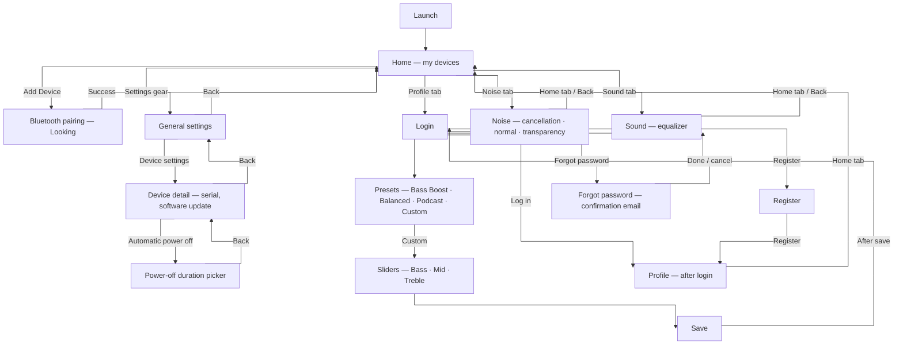

# Page flow

Wireframes and notes live under `docs/wireframes/`; element-level detail is in [`wireframes/WIREFRAME-ANALYSIS.md`](wireframes/WIREFRAME-ANALYSIS.md).

There is **exactly one canonical flow** below. It merges the paper **devices / profile / settings** journey with the Figma **four-tab** shell (**Home · Sound · Noise · Profile**):

- **Home** is the **my devices** hub (empty → populated after pairing), plus **settings gear** and the device card / connection / battery story from the sketches; Figma also places quick stats and a live EQ preview on Home (see comments in `figma-v3/`).
- **Sound** is the equalizer path from Figma (presets **Bass Boost · Balanced · Podcast · Custom**, **Bass / Mid / Treble** sliders, **Save** where shown)—aligned with the EQ portion of the paper device-control screen.
- **Noise** is the listening-mode path (**noise cancellation · normal · transparency**) from the paper control screen, exposed as its own tab in the merged IA.
- **Profile** is login / register / forgot password / after-login, as in the paper flows.

---

## Single app flow

**Notes**

- **Home** is one screen in the diagram; its **empty vs populated** list is a **state** after `Bluetooth pairing` succeeds, not a separate node.
- **Back** from settings returns to **Home** regardless of list state.
- **Sound** / **Noise** match the split introduced in Figma v3; the paper **device control** sheet combined model image, modes, and vertical EQ in one place—implementation maps that document to these two tabs plus **Home**.

---

## Wireframe assets

| Folder | File | Notes |
|--------|------|--------|
| `devices/` | `wireframe-devices-home-empty.jpeg` | My devices — empty state, Add Device |
| `devices/` | `wireframe-devices-list-populated.jpeg` | My devices — device card added |
| `devices/` | `wireframe-device-control-equalizer.jpeg` | Model, battery, modes, equalizer |
| `profile/` | `wireframe-login.jpeg` | Login (profile tab) |
| `profile/` | `wireframe-register.jpeg` | Registration form |
| `profile/` | `wireframe-profile-overview.jpeg` | After login — account info / my devices |
| `profile/` | `wireframe-profile-menu.jpeg` | After login — profile menu list |
| `profile/` | `wireframe-forgot-password-and-login.jpeg` | Forgot password + login (combined sheet) |
| `settings/` | `wireframe-settings-general.jpeg` | Language, theme, device settings entry |
| `settings/` | `wireframe-settings-device-detail.jpeg` | Device image, serial, power off, software update |
| `settings/` | `wireframe-settings-automatic-power-off.jpeg` | Auto power-off duration picker |
| `flowsheets/` | `flowsheet-add-device-and-settings.jpeg` | Vertical flow: empty home → Bluetooth → list → settings |
| `flowsheets/` | `flowsheet-auth-and-profile.jpeg` | Vertical flow: login → register → profile → forgot password |
| `flowsheets/` | `flowsheet-bluetooth-pairing.jpeg` | Bluetooth “looking” → my devices |
| `flowsheets/` | `flowsheet-device-settings-and-power-off.jpeg` | Device detail → automatic power off (+ placeholders) |
| `figma-v3/` | `wireframe-sound-equalizer-four-presets.jpeg` | Figma v3 **Sound** — four presets, Custom + Bass/Mid/Treble, 4-tab nav |
| `figma-v3/` | `wireframe-sound-equalizer-custom-save.jpeg` | Figma v3 **Sound** — presets + sliders + **Save**, 4-tab nav |

Paths are relative to `docs/wireframes/`.
