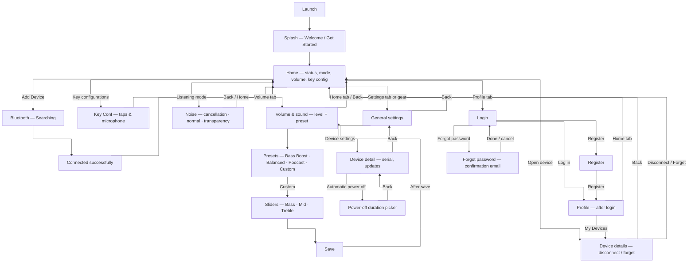

# Page flow

Wireframes and notes live under `docs/wireframes/`; element-level detail is in [`wireframes/WIREFRAME-ANALYSIS.md`](wireframes/WIREFRAME-ANALYSIS.md).

There is **exactly one canonical flow** below. It merges earlier paper + Figma work with the **nine-screen companion flowsheet** (`flowsheets/flowsheet-nine-screen-home-volume-settings-profile.jpeg`):

- **Splash** → **Get Started** → **Home** for a cold start.
- **Home** is the dashboard: connection status, battery, device identity, **current listening mode** (e.g. ANC on), **volume / preset** summary, and **Key configurations**.
- **Bottom navigation (this sheet):** **Home · Volume · Settings · Profile**. The **Volume** tab holds deeper **preset + EQ** steps (aligned with Figma **Sound**). **Listening mode** (noise cancellation · normal · transparency) is reachable from Home / Volume as in the merged diagram.
- **Bluetooth:** Add Device → Searching → **Connected successfully** → Home.
- **Settings** (tab or gear where sketched): app preferences (e.g. dark mode, notifications, language) and the **device settings** stack (detail, automatic power-off) from older wires.
- **Profile:** auth (login / register / forgot password) and post-login menu; **My Devices** leads to **Device details** (disconnect / forget).

A file under [`reference/`](wireframes/reference/) is **not** part of this product (e-learning UI); see analysis.

---

## Single app flow

**Notes**

- **Home** combines empty / connected / disconnected **states** (after **Forget** or **Disconnect**, user is back toward **Add Device** as needed).
- **Volume tab** + **Noise** together cover what older wires split across device-control and Figma **Sound** / **Noise** tabs—one implementation can use either tab labels or a single “Sound” tab if you collapse UI.
- **`reference/flowsheet-learnify-elearning-grid.jpeg`** is stored only as a labeled reference; it does **not** define this app’s flow.

---

## Wireframe assets

| Folder | File | Notes |
|--------|------|--------|
| `devices/` | `wireframe-devices-home-empty.jpeg` | My devices — empty state, Add Device |
| `devices/` | `wireframe-devices-list-populated.jpeg` | My devices — device card added |
| `devices/` | `wireframe-device-control-equalizer.jpeg` | Model, battery, modes, equalizer |
| `profile/` | `wireframe-login.jpeg` | Login (profile tab) |
| `profile/` | `wireframe-register.jpeg` | Registration form |
| `profile/` | `wireframe-profile-overview.jpeg` | After login — account info / my devices |
| `profile/` | `wireframe-profile-menu.jpeg` | After login — profile menu list |
| `profile/` | `wireframe-forgot-password-and-login.jpeg` | Forgot password + login (combined sheet) |
| `settings/` | `wireframe-settings-general.jpeg` | Language, theme, device settings entry |
| `settings/` | `wireframe-settings-device-detail.jpeg` | Device image, serial, power off, software update |
| `settings/` | `wireframe-settings-automatic-power-off.jpeg` | Auto power-off duration picker |
| `flowsheets/` | `flowsheet-add-device-and-settings.jpeg` | Vertical flow: empty home → Bluetooth → list → settings |
| `flowsheets/` | `flowsheet-auth-and-profile.jpeg` | Vertical flow: login → register → profile → forgot password |
| `flowsheets/` | `flowsheet-bluetooth-pairing.jpeg` | Bluetooth “looking” → my devices |
| `flowsheets/` | `flowsheet-device-settings-and-power-off.jpeg` | Device detail → automatic power off (+ placeholders) |
| `flowsheets/` | `flowsheet-nine-screen-home-volume-settings-profile.jpeg` | Nine-panel: splash → pair → home, Volume/Settings/Profile tabs, key config, device details |
| `figma-v3/` | `wireframe-sound-equalizer-four-presets.jpeg` | Figma **Sound** — four presets, Custom + Bass/Mid/Treble, 4-tab nav |
| `figma-v3/` | `wireframe-sound-equalizer-custom-save.jpeg` | Figma **Sound** — presets + sliders + **Save**, 4-tab nav |
| `reference/` | `flowsheet-learnify-elearning-grid.jpeg` | **Out of scope** — e-learning app grid (LEARNIFY); not earphone UX |

Paths are relative to `docs/wireframes/`.
