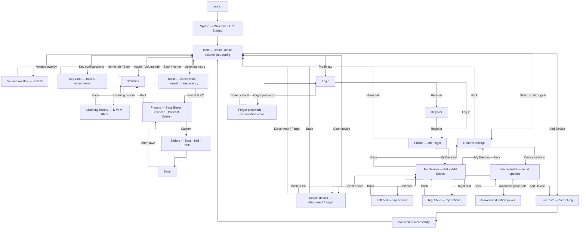

# Page flow

Wireframes and notes live under `docs/wireframes/`; element-level detail is in [`wireframes/WIREFRAME-ANALYSIS.md`](wireframes/WIREFRAME-ANALYSIS.md).

There is **exactly one canonical flow** below. It merges earlier paper + Figma + **nine-screen** flows with newer hand-drawn screens:

- **Splash** → **Home**; pairing **Add Device → Searching → Connected successfully** → Home.
- **Volume overlay** (capsule slider, %) can appear over Home / audio surfaces when adjusting level.
- **Audio · Volume tab:** lands on **Statistics**; **Listening history** drill-in; **Sound & EQ** (presets, Bass/Mid/Treble, **save**) from that branch (see `hand-drawn/` + `flowsheets/` assets).
- **Key configurations** (nine-panel) aligns with **Left / Right bud** tap lists (five-panel) — one implementation surface.
- **Settings:** general preferences **and** **My Devices** list → **Add Device** (same Bluetooth spine), **Left** / **Right** bud actions, and (where sketched) **device detail** / power-off stack.
- **Profile** auth and **My Devices** / **Open device** → **Device details** as before.

A file under [`reference/`](wireframes/reference/) is **not** part of this product (e-learning UI); see analysis.

---

## Single app flow

**Notes**

- **Statistics ↔ Sound:** Some sketches use the **speaker tab** only for EQ; others use it for **Statistics** first—this diagram orders **Statistics** then **Sound & EQ** as a drill-in; you may flatten to one tab with segments if you prefer.
- **Key conf vs bud screens:** **KC** and **LB/RB** describe the same product behavior (per-bud gestures); implement once.
- **`reference/flowsheet-learnify-elearning-grid.jpeg`** is out of scope for this app.

---

## Wireframe assets

| Folder | File | Notes |
|--------|------|--------|
| `devices/` | `wireframe-devices-home-empty.jpeg` | My devices — empty state, Add Device |
| `devices/` | `wireframe-devices-list-populated.jpeg` | My devices — device card added |
| `devices/` | `wireframe-device-control-equalizer.jpeg` | Model, battery, modes, equalizer |
| `profile/` | `wireframe-login.jpeg` | Login (profile tab) |
| `profile/` | `wireframe-register.jpeg` | Registration form |
| `profile/` | `wireframe-profile-overview.jpeg` | After login — account info / my devices |
| `profile/` | `wireframe-profile-menu.jpeg` | After login — profile menu list |
| `profile/` | `wireframe-forgot-password-and-login.jpeg` | Forgot password + login (combined sheet) |
| `settings/` | `wireframe-settings-general.jpeg` | Language, theme, device settings entry |
| `settings/` | `wireframe-settings-device-detail.jpeg` | Device image, serial, power off, software update |
| `settings/` | `wireframe-settings-automatic-power-off.jpeg` | Auto power-off duration picker |
| `flowsheets/` | `flowsheet-add-device-and-settings.jpeg` | Vertical flow: empty home → Bluetooth → list → settings |
| `flowsheets/` | `flowsheet-auth-and-profile.jpeg` | Vertical flow: login → register → profile → forgot password |
| `flowsheets/` | `flowsheet-bluetooth-pairing.jpeg` | Bluetooth “looking” → my devices |
| `flowsheets/` | `flowsheet-device-settings-and-power-off.jpeg` | Device detail → automatic power off (+ placeholders) |
| `flowsheets/` | `flowsheet-nine-screen-home-volume-settings-profile.jpeg` | Nine-panel: splash → pair → home, tabs, key config, device details |
| `flowsheets/` | `flowsheet-statistics-history-mydevices-bud-controls.jpeg` | Five-panel: statistics, listening history, my devices, left/right bud |
| `hand-drawn/` | `wireframe-sound-equalizer-presets-sliders.jpeg` | **Sound** — four presets, Bass/Mid/Treble, save, 4-tab nav |
| `hand-drawn/` | `wireframe-volume-overlay-vertical.jpeg` | Volume capsule overlay, %65, blurred chrome behind |
| `figma-v3/` | `wireframe-sound-equalizer-four-presets.jpeg` | Figma **Sound** — four presets, Custom + sliders |
| `figma-v3/` | `wireframe-sound-equalizer-custom-save.jpeg` | Figma **Sound** — presets + sliders + **Save** |
| `reference/` | `flowsheet-learnify-elearning-grid.jpeg` | **Out of scope** — LEARNIFY e-learning grid |

Paths are relative to `docs/wireframes/`.
