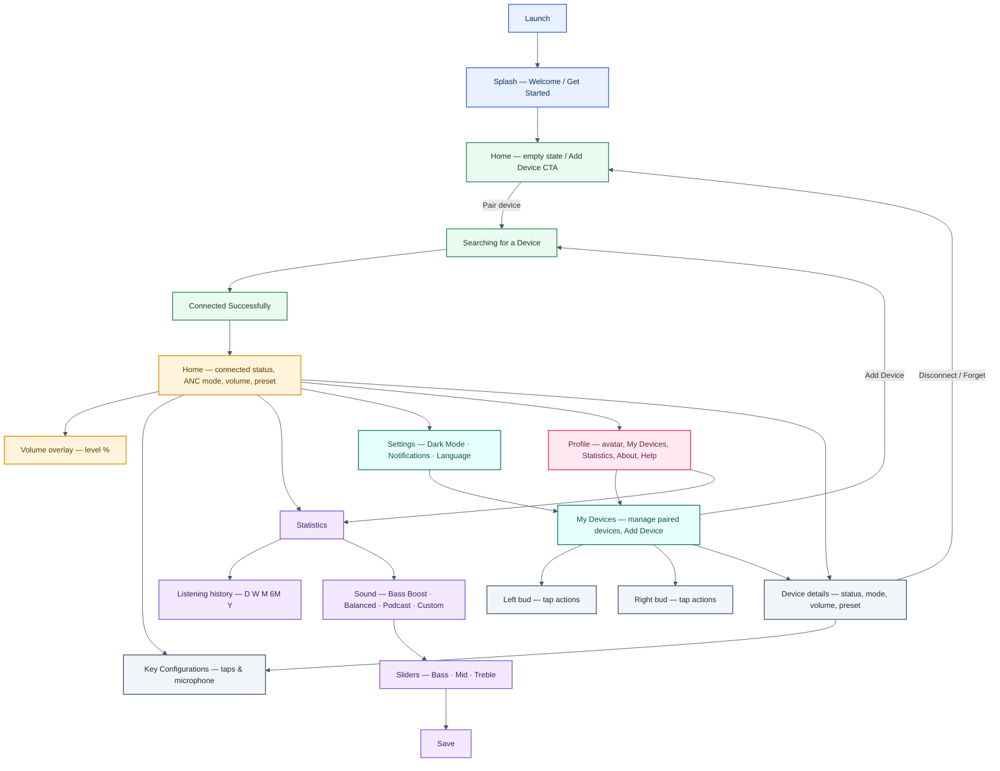

# Page flow

Wireframes and notes live under `docs/wireframes/`; element-level detail is in [`wireframes/WIREFRAME-ANALYSIS.md`](wireframes/WIREFRAME-ANALYSIS.md).

This page now reflects **Version 2 only**. The flow below is based on the surviving **four-tab** wireframes and `Wireframes-Complete-Version2.pdf`, so the older **Version 1** two-tab auth and paper settings flows are intentionally excluded.

- **Onboarding / pairing:** **Splash** leads to **Home (empty state)**, where **Add Device** is the primary call to action. Pairing then moves through **Searching for a Device** → **Connected Successfully** → **Home (connected state)**.
- **Shared V2 shell:** primary navigation is **Home**, **Sound**, **Settings**, **Profile**.
- **Sound tab:** **Statistics** is the summary view; **Listening History** drills deeper; **Sound / EQ** holds presets plus **Bass / Mid / Treble** sliders and **Save**.
- **Settings / Profile overlap:** V2 sheets place **My Devices** and **Statistics** in slightly different tabs, but they point to the same product surfaces, so they are modeled as shared destinations.
- **Two add-device contexts:** first pairing happens from **Home (empty state)**; later device management happens in **My Devices**.
- **Device controls:** **Key Configurations** and the **Left / Right** bud action screens describe the same gesture-mapping area at different zoom levels.

A file under [`reference/`](wireframes/reference/) is **not** part of this product (e-learning UI); see analysis.

---

## Single app flow

## Notes

- **Version scope:** This diagram excludes the older **Version 1** paper-only screens such as **Login / Register / Forgot password** and the older serial / automatic-power-off device-settings stack.
- **Home and Add Device:** the wireframes show **Add Device** as a prominent standalone frame, but for information architecture it is modeled as the **empty state of Home** for first-time pairing.
- **Colors:** blue = launch, green = pairing, amber = Home, purple = Sound, teal = Settings, pink = Profile, gray = device-specific screens.
- **Arrow clarity:** this is a simplified information architecture diagram, so it emphasizes primary paths and drill-down relationships instead of drawing every possible back-navigation arrow.
- **My Devices meaning:** **My Devices** represents post-pairing management. It can still include an **Add Device** action to add another device later.
- **Statistics ↔ Sound:** One V2 sheet opens the speaker tab on **Statistics** and another shows a dedicated **Sound** EQ page; this diagram keeps both under the same **Sound** branch.
- **Settings ↔ Profile shortcuts:** V2 places **My Devices** and **Statistics** in different tabs across different sheets. They are treated here as shared destinations rather than separate duplicate screens.
- **Key conf vs bud screens:** **KC** and **LB/RB** describe the same gesture-mapping behavior (per-bud actions) at different levels of detail.
- **`reference/flowsheet-learnify-elearning-grid.jpeg`** is out of scope for this app.

---

## Version 2 source assets

| Folder | File | Notes |
| ------ | ---- | ----- |
| `.` | `Wireframes-Complete-Version2.pdf` | Combined PDF reference for the V2 screens; used to confirm which flows remain in scope |
| `flowsheets/` | `flowsheet-nine-screen-home-volume-settings-profile.jpeg` | Splash, Add Device, Searching, Success, Home, Settings, Profile, Device details, Key Configurations |
| `flowsheets/` | `flowsheet-statistics-history-mydevices-bud-controls.jpeg` | Statistics, Listening History, My Devices, Left bud, Right bud |
| `hand-drawn/` | `wireframe-sound-equalizer-presets-sliders.jpeg` | V2 **Sound / EQ** screen with presets, Bass/Mid/Treble, Save, 4-tab nav |
| `hand-drawn/` | `wireframe-volume-overlay-vertical.jpeg` | V2 volume overlay with level percentage over the shared app chrome |
| `reference/` | `flowsheet-learnify-elearning-grid.jpeg` | **Out of scope** — LEARNIFY e-learning grid |

Paths are relative to `docs/wireframes/`.
