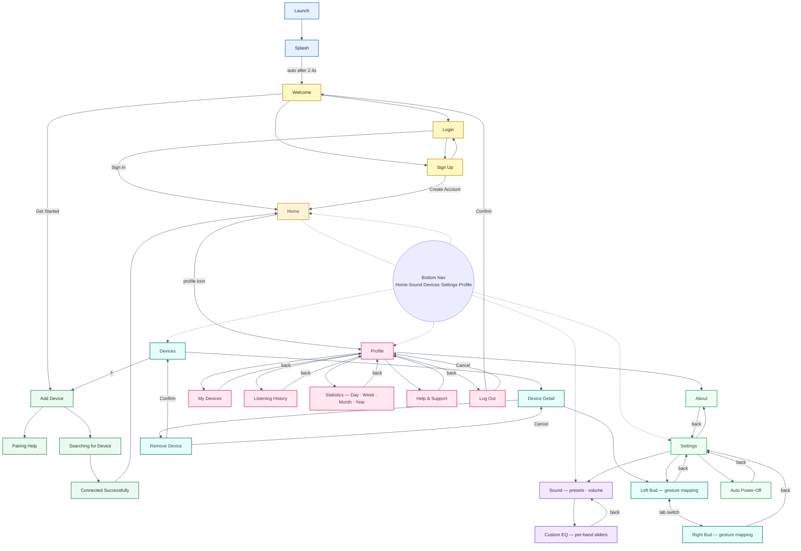

# Page flow

Wireframes and notes live under `docs/wireframes/`; element-level detail is in [`wireframes/WIREFRAME-ANALYSIS.md`](wireframes/WIREFRAME-ANALYSIS.md).

This diagram reflects the **implemented React Native app** (`rn-app/`). All screens listed below exist as `.tsx` files under `rn-app/src/screens/`.

- **Onboarding:** **Splash** → **Welcome (Login / Sign Up)** → **Home**.
- **Pairing flow:** Home → **Add Device** → **Searching** → **Connected** → Home (connected state).
- **Bottom nav tabs:** Home · Sound · Devices · Settings · Profile (5 tabs).
- **Sound tab:** Preset selection + volume; drill into **Custom EQ** (per-band sliders).
- **Settings tab:** Dark Mode toggle · Notifications · Auto Power-Off · About · User Guide · Log Out; drill into **Earbud Controls** (Left / Right bud gesture mapping).
- **Devices tab:** paired device list; drill into **Device Detail** → **Remove Device** or **Earbud Controls**.
- **Profile tab:** avatar + stats summary; drill into **My Devices**, **Listening History**, **Statistics** (Day/Week/Month/Year tabs), **Help & Support**, **Log Out**.
- **Auth screens:** Login and Sign Up are reachable from Welcome; Log Out returns to Welcome.

---

## Single app flow

```mermaid
%%{init: {"flowchart": {"curve": "basis", "nodeSpacing": 40, "rankSpacing": 65}, "themeVariables": {"lineColor": "#475569", "fontSize": "14px"}}}%%
flowchart TD
    classDef start   fill:#e8f1ff,stroke:#3563e9,color:#102a56,stroke-width:1.5px;
    classDef auth    fill:#fef9c3,stroke:#ca8a04,color:#451a03,stroke-width:1.5px;
    classDef pairing fill:#eafaf1,stroke:#2f855a,color:#163826,stroke-width:1.5px;
    classDef home    fill:#fff4db,stroke:#dd8a00,color:#5c3b00,stroke-width:1.5px;
    classDef sound   fill:#f3e8ff,stroke:#805ad5,color:#3b1f63,stroke-width:1.5px;
    classDef devices fill:#e6fffb,stroke:#0f766e,color:#134e4a,stroke-width:1.5px;
    classDef settings fill:#f0fdf4,stroke:#16a34a,color:#14532d,stroke-width:1.5px;
    classDef profile fill:#ffe8ef,stroke:#db2777,color:#6b2149,stroke-width:1.5px;

    A[Launch] --> SPL[Splash]
    SPL -->|auto after 2.4s| WEL[Welcome]

    WEL --> LGN[Login]
    WEL --> SGN[Sign Up]
    WEL -->|Get Started| AD[Add Device]

    LGN -->|Sign In| HC[Home]
    LGN --> SGN
    SGN -->|Create Account| HC
    SGN --> LGN

    AD --> PH[Pairing Help]
    AD --> SRCH[Searching for Device]
    SRCH --> CON[Connected Successfully]
    CON --> HC

    HC -->|profile icon| P[Profile]

    HC -.- NAV(( Bottom Nav\nHome·Sound·Devices·Settings·Profile ))
    NAV -.-> HC
    NAV -.-> SND[Sound — presets · volume]
    NAV -.-> DEV[Devices]
    NAV -.-> SET[Settings]
    NAV -.-> P

    SND --> EQ[Custom EQ — per-band sliders]
    EQ -->|back| SND

    DEV -->|＋| AD
    DEV --> DD[Device Detail]
    DD --> EBL[Left Bud — gesture mapping]
    EBL <-->|tab switch| EBR[Right Bud — gesture mapping]
    EBL -->|back| SET
    EBR -->|back| SET
    DD --> RMV[Remove Device]
    RMV -->|Confirm| DEV
    RMV -->|Cancel| DD

    SET --> SND
    SET --> EBL
    SET --> APO[Auto Power-Off]
    SET --> ABT[About]
    APO -->|back| SET
    ABT -->|back| SET

    P --> MD[My Devices]
    P --> LH[Listening History]
    P --> STAT[Statistics — Day · Week · Month · Year]
    P --> ABT
    P --> HLP[Help & Support]
    P --> LGO[Log Out]
    MD -->|back| P
    LH -->|back| P
    STAT -->|back| P
    HLP -->|back| P
    LGO -->|Confirm| WEL
    LGO -->|Cancel| P

    class A,SPL start
    class WEL,LGN,SGN auth
    class AD,PH,SRCH,CON pairing
    class HC home
    class SND,EQ sound
    class DEV,DD,EBL,EBR,RMV devices
    class SET,APO,ABT settings
    class P,MD,LH,STAT,HLP,LGO profile
```

## Notes

- **5-tab nav:** Home · Sound · Devices · Settings · Profile. Dashed lines show bottom-nav reachability from any tab screen.
- **Get Started vs Login:** Welcome offers both paths — "Get Started" goes straight to Add Device (pairing) without an account; Login/Sign Up go to Home.
- **Pairing Help:** accessible from Add Device as a "How to Pair?" link; back returns to Add Device.
- **Earbud Controls:** reachable from both Settings and Devices → Device Detail. Back button always returns to Settings.
- **About:** reachable from both Settings and Profile.
- **Remove Device:** Confirm → Devices list; Cancel → back to Device Detail.
- **Log Out:** Confirm → Welcome; Cancel → back to Profile.
- **Dark mode:** toggled via Settings → Dark Mode switch; applies globally via `ThemeContext`.
- **Statistics tabs:** Day / Week / Month / Year each display distinct listening time, trend, bar chart, and genre breakdown.
- **Colors:** blue = launch, yellow = auth, green = pairing, amber = Home, purple = Sound, teal = Devices, light-green = Settings, pink = Profile.

---

## Version 2 source assets

| Folder | File | Notes |
| ------ | ---- | ----- |
| `.` | `Wireframes-Complete-Version2.pdf` | Combined PDF reference for the V2 screens; used to confirm which flows remain in scope |
| `flowsheets/` | `flowsheet-nine-screen-home-volume-settings-profile.jpeg` | Splash, Add Device, Searching, Success, Home, Settings, Profile, Device details, Key Configurations |
| `flowsheets/` | `flowsheet-statistics-history-mydevices-bud-controls.jpeg` | Statistics, Listening History, My Devices, Left bud, Right bud |
| `hand-drawn/` | `wireframe-sound-equalizer-presets-sliders.jpeg` | V2 **Sound / EQ** screen with presets, Bass/Mid/Treble, Save, 4-tab nav |
| `hand-drawn/` | `wireframe-volume-overlay-vertical.jpeg` | V2 volume overlay with level percentage over the shared app chrome |
| `smartwatch/` | `wireframe-smartwatch-high-fidelity.jpeg` | High-fidelity smartwatch prototype for Vestel watch interface |
| `reference/` | `flowsheet-learnify-elearning-grid.jpeg` | **Out of scope** — LEARNIFY e-learning grid |

Paths are relative to `docs/wireframes/`.
